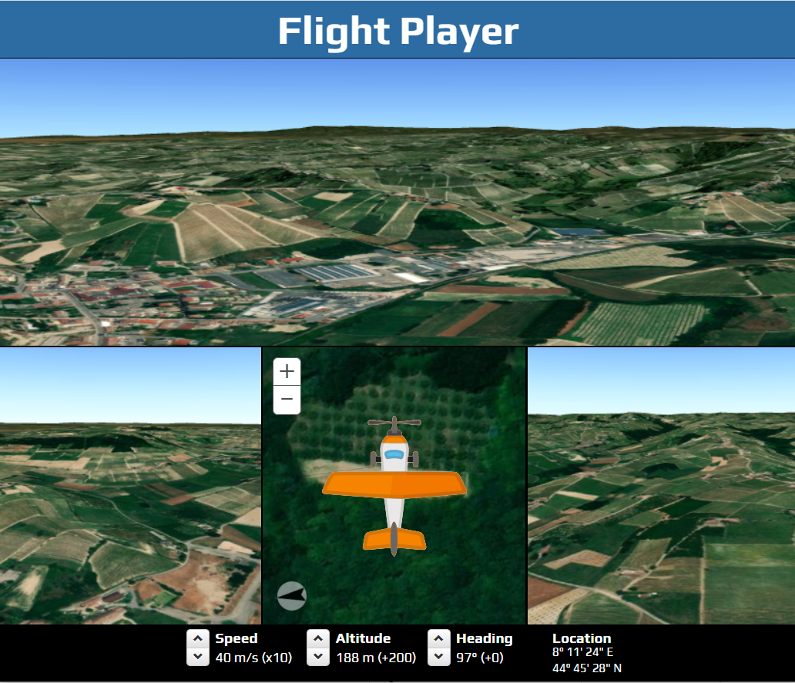

# Flight Player

A basic flight player with four synchronized views.

Initially inspired by [Flight Simulator](https://github.com/richiecarmichael/Esri-Flight-Simulator), this project aims to reproduce a flight recorded in a .gpx file.

**See the player in action [here](https://starnutoditopo.github.io/flight-player/www/index.html)!**

#### Quick run from file system

Ensure a directory exists to host Chrome data (eg.: C:\ChromeData), then, from the directory containing index.html, run Chrome with the following parameters:

    "C:\Program Files (x86)\Google\Chrome\Application\chrome.exe" --allow-file-access-from-files --disable-site-isolation-trials --disable-web-security --user-data-dir=C:\ChromeData index.html
    

#### This application makes use of the following libraries:

* [ArcGIS API for JavaScript](https://developers.arcgis.com/javascript/) by [Esri](http://www.esri.com/)
  - Esri’s JavaScript library for mapping and analysis.
* [Bootstrap](http://getbootstrap.com/) by [Twitter Inc](https://twitter.com/)
  - A useful and comprehensive UI framework. This application leveraged a subset of bootstrap pertaining to buttons and input elements.
* [d3-format](https://github.com/d3/d3-format) by [Mike Bostock](https://github.com/mbostock)
  - Format numbers for human consumption.
* [jQuery](http://jquery.com/) by jQuery Foundataion Inc
  - A JavaScript framework for DOM manipulation and a foundation for many other frameworks.
* [Sylvester](http://sylvester.jcoglan.com/) by [James Coglan](http://jcoglan.com/)
  - Vector and Matrix mathematics modules for JavaScript.

#### Screen-shot:

